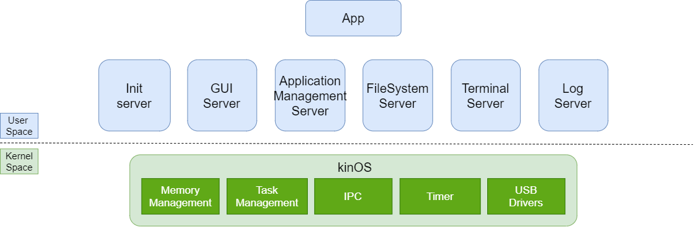

# はじめに

[『ゼロからの OS 自作入門』内田公太(2021)](https://www.amazon.co.jp/%E3%82%BC%E3%83%AD%E3%81%8B%E3%82%89%E3%81%AEOS%E8%87%AA%E4%BD%9C%E5%85%A5%E9%96%80-%E5%86%85%E7%94%B0-%E5%85%AC%E5%A4%AA/dp/4839975868)を一通り読んだので、この本で作る[MikanOS](https://github.com/uchan-nos/mikanos)を自分なりに改造してみました。

# 本の感想

まず、この本以前に技術書を読んだ経験がなく、コードも大学の課題ぐらいでしか書いたことがなかったので、一通り本を読んでコードを写経し終わったときはとても達成感がありました。

内容は、自分にとっては結構難しく感じました。というのも、自分は OS どころか低レイヤについても何も知らない状態で読み始めたからだと思います。実際読み切るまでに 3~4 ヶ月ほどかかり、その間には 1 度挫折しています。この本をスムーズに読むには、ある程度低レイヤや OS についての知識があったほうがいいかもしれません。ただ OS を作るにはたくさんの知識が必要ですが、この本はそれらのことについてわかりやすく丁寧に書かれているので、全く知識がなかった自分でも時間をかけて理解することができました。

またこの本は OS のことだけではなく、C++の文法や、ポインタについての解説もあるので、プログラミング経験があまりない自分にはありがたかったです。

# MikanOS を改造してみた

せっかく読み終わったので、この本で作る MikanOS を改造してみました。OS について調べていく中で、マイクロカーネルという概念を知ったので、MikanOS をそれっぽくしてみたら面白いんじゃないかと思いました。マイクロカーネルについては[Wikipedia](https://ja.wikipedia.org/wiki/%E3%83%9E%E3%82%A4%E3%82%AF%E3%83%AD%E3%82%AB%E3%83%BC%E3%83%8D%E3%83%AB)から引用します。

> マイクロカーネル（英: microkernel）とはオペレーティングシステム (OS) の設計思想、及びそのような OS のカーネル部の名称である。OS が担う各種機能のうち、必要最小限のみをカーネル空間に残し、残りをユーザーレベルに移すことで全体の設計が簡素化でき、結果的にカスタマイズ性が向上し、性能も向上できるという OS の設計手法のことである。
>
> 「マイクロカーネル」『フリー百科事典 ウィキペディア日本語版』 最終更新日時 2021 年 8 月 31 日 17:32 UTC アクセス日時 2021 年 12 月 31 日 06:40 UTC URL: https://ja.wikipedia.org

MikanOS はカーネルの中に GUI やファイルシステムがあるので設計としてはモノリシックだと思います。改造するにあたり、そのような機能をユーザー空間でアプリケーションとして再実装することを目標にしました。また以下では OS の一部の機能を提供するユーザー空間のアプリケーションをサーバと呼んでいます。

# できたもの

[kinOS](https://github.com/kinpoko/kinOS)

{{}}

# kinOS の構成

{{}}

# kinOS のマイクロカーネルっぽいところ

MikanOS ではカーネルの中にあったファイルシステムやターミナル、ウインドウシステムなどの GUI が、kinOS では、サーバとしてユーザー空間で再実装されています。また、MikanOS でアプリケーションが用いていたシステムコールはアプリ終了用とタイマー関係とメモリ関係以外は IPC(プロセス間通信)を使って再実装しています。IPC には MikanOS でも用いられていたメッセージパッシングを少し変えて使っています。

# kinOS のマイクロカーネルっぽくないところ

通常マイクロカーネルのカーネル内には必要最低限の機能しか残さないのですが、気楽にやっているので、今の自分の技術ではユーザー空間に切り出すのが難しかった機能(メモリ管理とか USB ドライバなど)はそのまま残してます。結果としてマイクロカーネルライクな OS になりました。メモリマップドファイルなどの一部の MikanOS にあった機能も難しかったので実装できていません。

# 終わりに

『ゼロからの OS 自作入門』を読んで写経するだけでなく、改造したことで本の内容の理解がより深まったと思います。この本のおかげで、低レイヤへの興味が湧いてきたので次は CPU について学びたいと思います。
